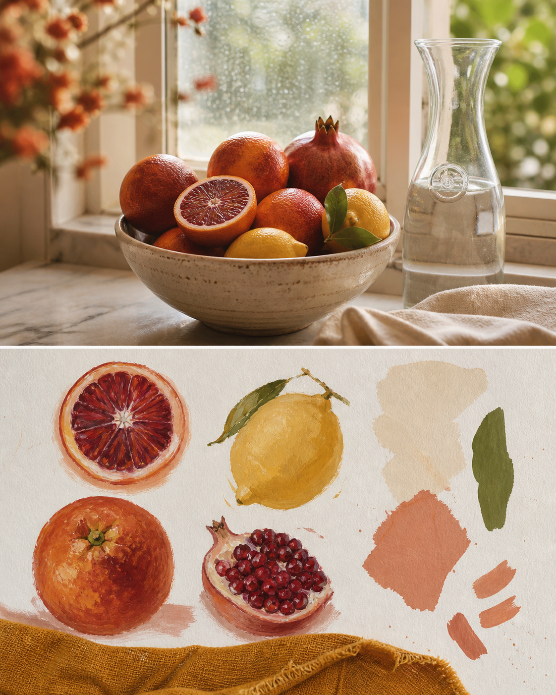
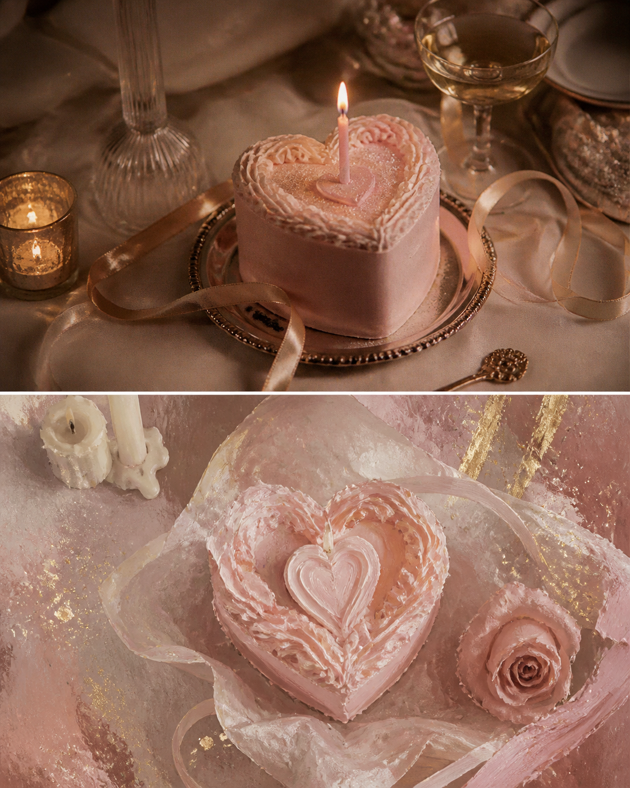
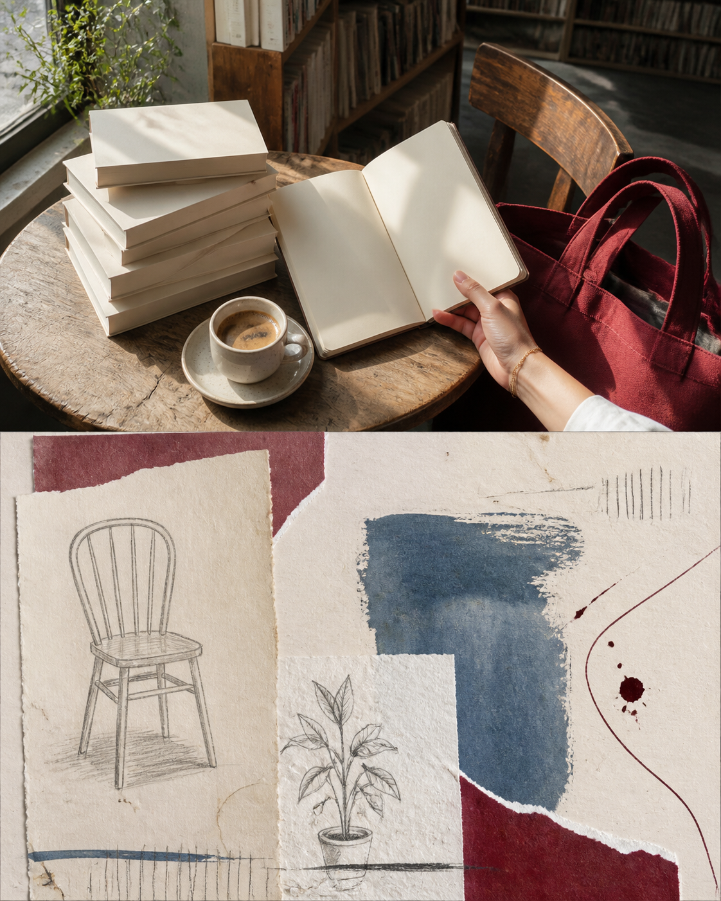
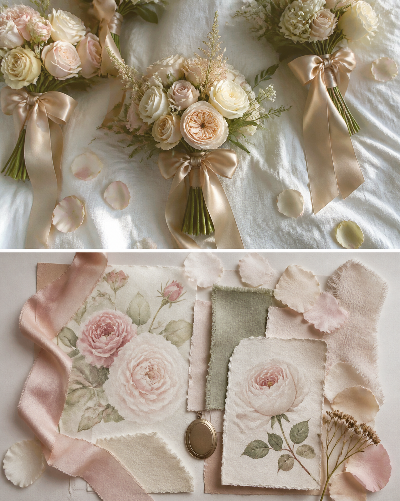
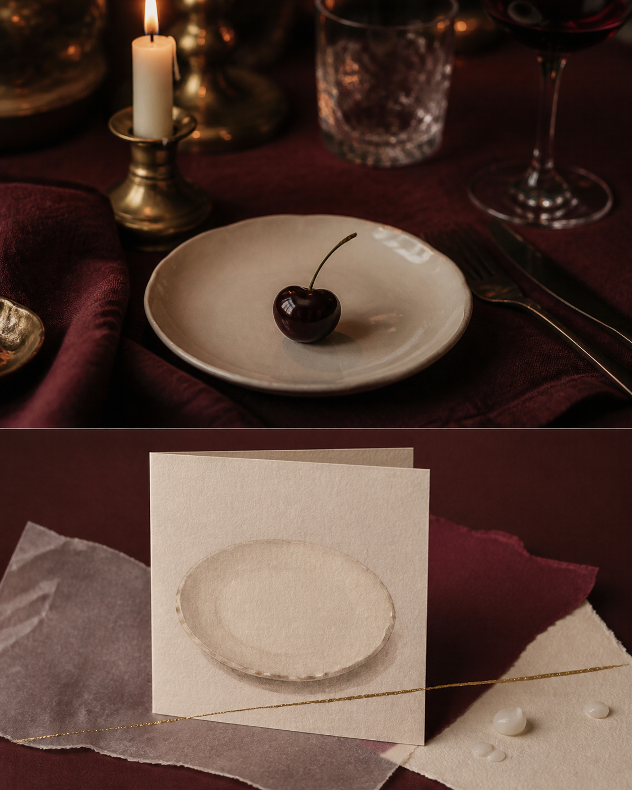

# Awesome Memory Image Skills

> 把一张照片做成值得收藏的上下拼接视觉日记：上半保留真实瞬间，下半以原创插画、纸感拼贴或艺术研究重新书写记忆。  
> Turn one photograph into a collectible upper/lower visual diary: a real moment above, an original artistic interpretation below.

**已发布 6 个原创 Skill / 6 original Skills published** · 每个页面均含 3 张无文字样图、双语说明、Codex 安装方式与独立 PixPix 工作流。

> **[在 PixPix 开始创作 →](https://www.pixpix.com/?source=github1)**

## 为什么是上下拼接？ / Why upper + lower?

不是把照片套进同一张模板。每个 Skill 都保留照片上半部分的地点、光线和最重要的细节；下半部分从画面里提取颜色、物件和情绪，生成一页独立的纸上创作。适合旅行、日常、食物、穿搭和想留下来的微小瞬间。

This is not a one-template filter. The upper panel keeps the place, light, and meaningful detail; the lower panel turns its colors, objects, and mood into a self-contained paper artwork.

## 已发布精选 / Published highlights

### [Cobalt Travel Tile / 钴蓝旅行瓷片](skills/photo-to-cobalt-travel-tile/README.md)

旅行照片上半保留海岸、街道或建筑的真实呼吸；下半将画面重组为手绘钴蓝瓷片、浅色地图轮廓与暖白纸感。适合海边、老城、市场和带有蓝色细节的旅途。

The real travel moment stays above; the lower panel becomes hand-painted cobalt fragments, a soft map contour, and warm paper texture.

**[查看完整介绍与安装 →](skills/photo-to-cobalt-travel-tile/README.md)** · **[在 PixPix 生成钴蓝旅行瓷片 →](https://www.pixpix.com/?source=github10)**

### [Fruit Still Life Note / 果物静物便签](skills/photo-to-fruit-still-life-note/README.md)

将一顿早餐、窗边水果或市集小景做成安静而饱满的果物便签：上半是自然光下的真实食物照片，下半是水粉果物习作、布料色样与手工纸拼贴。适合早餐、下午茶、厨房与季节性食物记录。

Transform food photos into a warm design keepsake: real fruit and light above, original gouache studies, linen swatches, and handmade-paper forms below.

**[查看完整介绍与安装 →](skills/photo-to-fruit-still-life-note/README.md)** · **[在 PixPix 生成果物静物便签 →](https://www.pixpix.com/?source=github11)**

### [Birthday Cake Diary / 生日蛋糕日记](skills/photo-to-birthday-cake-diary/README.md)

把生日蛋糕、烛光、花束或一次小型庆祝做成不过分甜腻的纪念页：上半保留真实的灯光与餐桌，下半重绘为水粉蛋糕、丝带、蜡感和克制的闪光纸片。

Keep the real cake and candlelit celebration above; turn the lower panel into an original grown-up paper diary of frosting, ribbon, wax, and quiet sparkle.

**[查看完整介绍与安装 →](skills/photo-to-birthday-cake-diary/README.md)** · **[在 PixPix 生成生日蛋糕日记 →](https://www.pixpix.com/?source=github12)**

### [Bookstore Marginalia / 书店页边笔记](skills/photo-to-bookstore-marginalia/README.md)

把书店、咖啡、手提袋和安静的城市片刻转成没有书名与正文的纸上页边笔记：上半保留书架光影，下半用留白、铅笔线、纸边和深酒红墨痕写下情绪。

Keep the bookstore moment above; the lower panel becomes a rights-aware, text-free composition of blank margins, pencil shelf objects, paper edges, and oxblood ink.

**[查看完整介绍与安装 →](skills/photo-to-bookstore-marginalia/README.md)** · **[在 PixPix 生成书店页边笔记 →](https://www.pixpix.com/?source=github13)**

### [Bridesmaid Bloom Page / 伴娘花束页](skills/photo-to-bridesmaid-bloom-page/README.md)

把伴娘花束、丝带和明亮房间里的相处瞬间留成一页轻盈而不模板化的庆祝记忆：上半真实，下半以水彩花材、棉纸、织物和小挂坠重组。

Turn flowers, fabric, and shared celebration into an original botanical keepsake: real moment above, watercolor blooms, ribbon, paper, and a tiny charm below.

**[查看完整介绍与安装 →](skills/photo-to-bridesmaid-bloom-page/README.md)** · **[在 PixPix 生成伴娘花束页 →](https://www.pixpix.com/?source=github14)**

### [Candlelight Dinner Card / 烛光晚餐卡](skills/photo-to-candlelight-dinner-card/README.md)

把一张晚餐照片变成克制而亲密的小型艺术卡：上半保留烛光、餐盘与阴影，下半以无文字折卡、半透明纸、蜡感和细金线重组。

Turn a dinner photo into a minimal intimate art card: real candlelight and table details above, a blank folded card, vellum, wax, and fine gold below.

**[查看完整介绍与安装 →](skills/photo-to-candlelight-dinner-card/README.md)** · **[在 PixPix 生成烛光晚餐卡 →](https://www.pixpix.com/?source=github15)**

## 安装到 Codex / Install in Codex

1. 克隆或下载本仓库：`git clone https://github.com/Jack-chen-cyber/awesome-memory-image-skills.git`。
2. 选择一个完整目录，例如 `skills/photo-to-fruit-still-life-note`，复制到 `%USERPROFILE%\.codex\skills\`。
3. 重启或重新加载 Codex，并在对话中调用对应的 `$skill-name`。

每个 Skill 的 `README.md` 有更具体的使用方式、三张示例和权利边界；请保留 `agents/`、`examples/`、`LICENSE.md` 与 `SKILL.md`，不要只复制一个提示词文件。

For full guidance, keep the entire Skill directory—not only `SKILL.md`.

## 全部已发布 Skill / Browse the complete collection

**[打开图文聚合页 →](catalog/published-skill-index.md)**

## 权利与边界 / Rights and boundaries

本仓库仅发布原创指令。请仅上传拥有使用权的照片；不要用这些 Skill 复刻品牌、艺术家或受版权保护的图像。下半部分是原创视觉解释，不是对原作的临摹或事实档案。PixPix 链接是独立工作流入口，不代表 PixPix 托管本仓库内容。

Only upload images you are entitled to use. Do not use these Skills to reproduce brands, artists, or copyrighted images. PixPix is an independent workflow and does not host these Skills.
