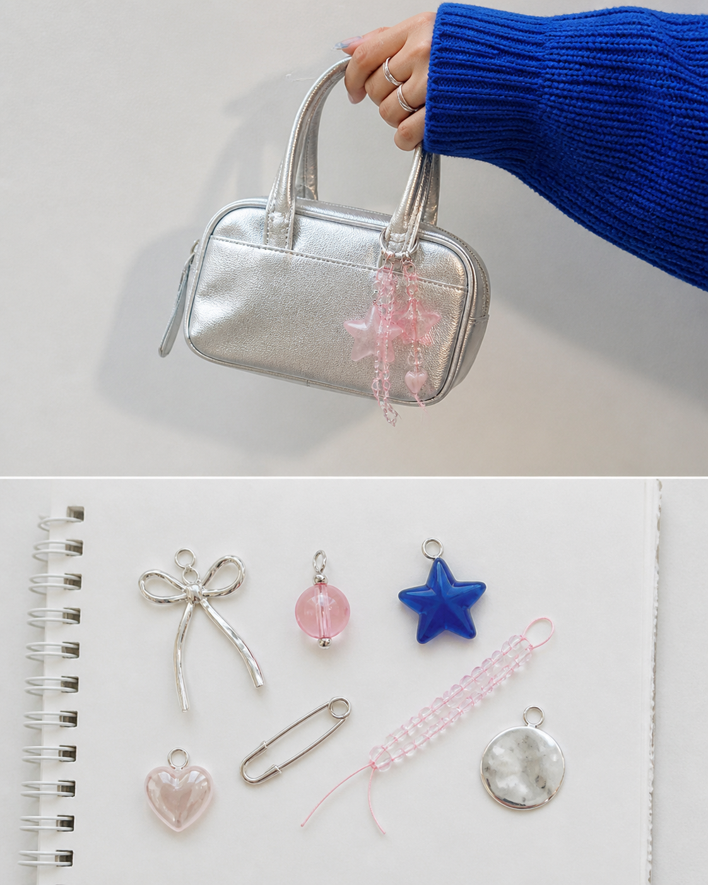
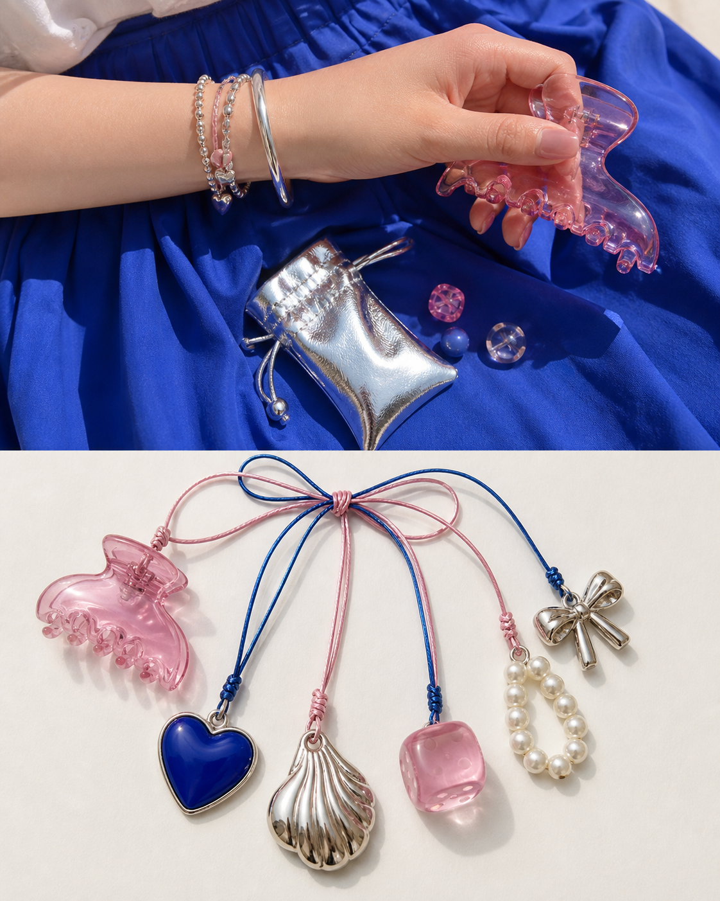
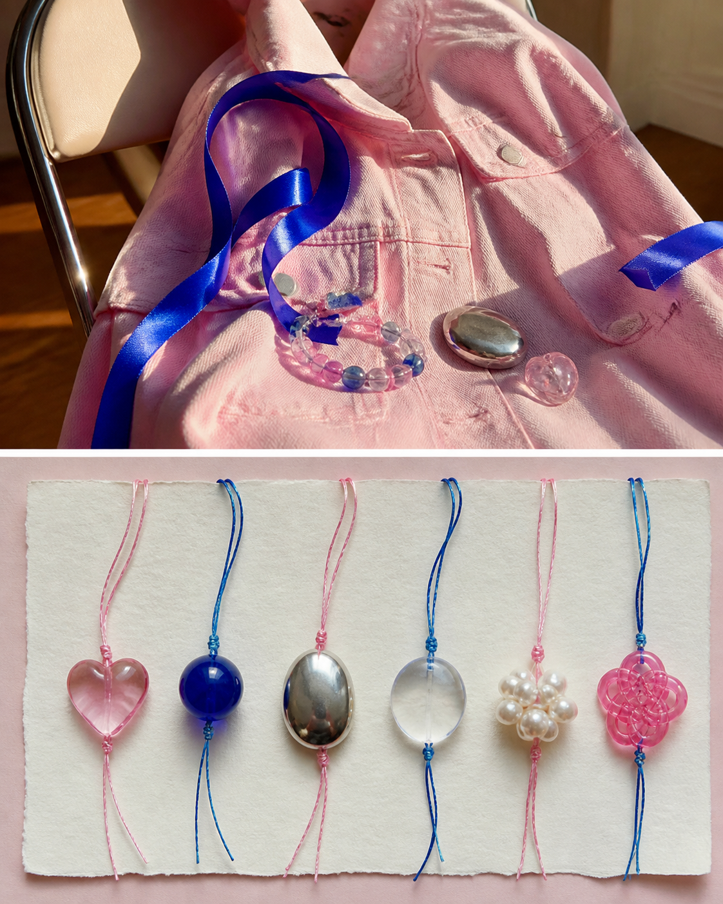

# Charm Bracelet Board

> **[Generate this style in PixPix →](https://www.pixpix.com/?source=github61)**

[中文](README.md)

An original `玩趣收藏` image-making Skill. It keeps the upper part of a photograph recognisable, then rebuilds the lower panel as an original charm-board layout with 5–7 symbolic non-branded charms and threads. The goal is collectible micro-objects designed for saves.

## Three text-free examples

## Best for

small personal object, colour, bag or outfit detail. Its default tone is playful and polished, with silver, jelly pink, cobalt and the tactile character of plastic shine, metal, notebook paper.

## Use

`Use $photo-to-charm-bracelet-board to process this photo at editorial density, focusing on one detail that matters to me.`

## Rights

Original instructions by Jack-chen-cyber. Upload only images you are entitled to use. The Skill must not reproduce brands, artists, copyrighted imagery, tickets, pages, routes, or source text; the lower panel is an original interpretation, not a factual archive.

- License: [CC BY-NC 4.0](LICENSE.md)
- PixPix workflow: [PixPix](https://www.pixpix.com/?source=github61)
## Install in Codex

1. Clone or download this repository: `git clone https://github.com/Jack-chen-cyber/awesome-memory-image-skills.git`.
2. Copy the complete `skills/photo-to-charm-bracelet-board` directory into Codex's Skills directory; on Windows, the default is `%USERPROFILE%\.codex\skills\photo-to-charm-bracelet-board`.
3. Restart or reload Codex, then invoke `$photo-to-charm-bracelet-board` in a conversation.

Do not copy only `SKILL.md`; keep `agents/`, `LICENSE.md`, and the page files with the Skill.

## Generate in PixPix

> **[Generate this style in PixPix →](https://www.pixpix.com/?source=github61)**
>
> Upload a photo you have the right to use, choose an upper/lower composition, and give PixPix this Skill name plus the detail you want to emphasise. PixPix is an independent generation workflow and does not host this Skill.
