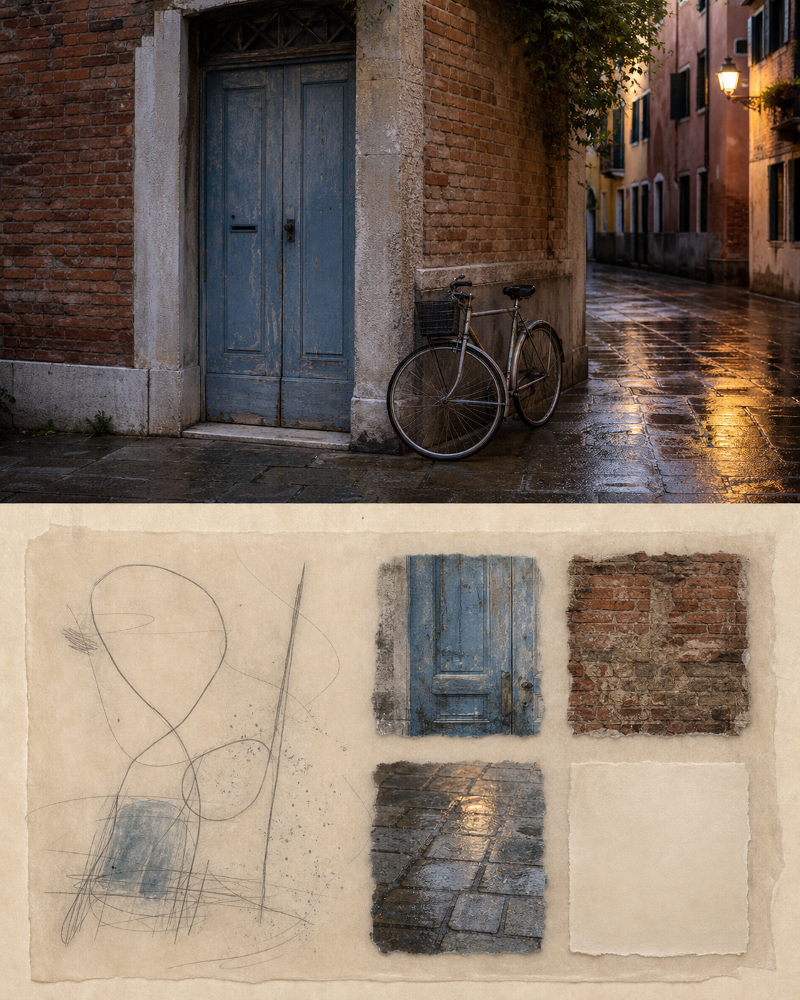
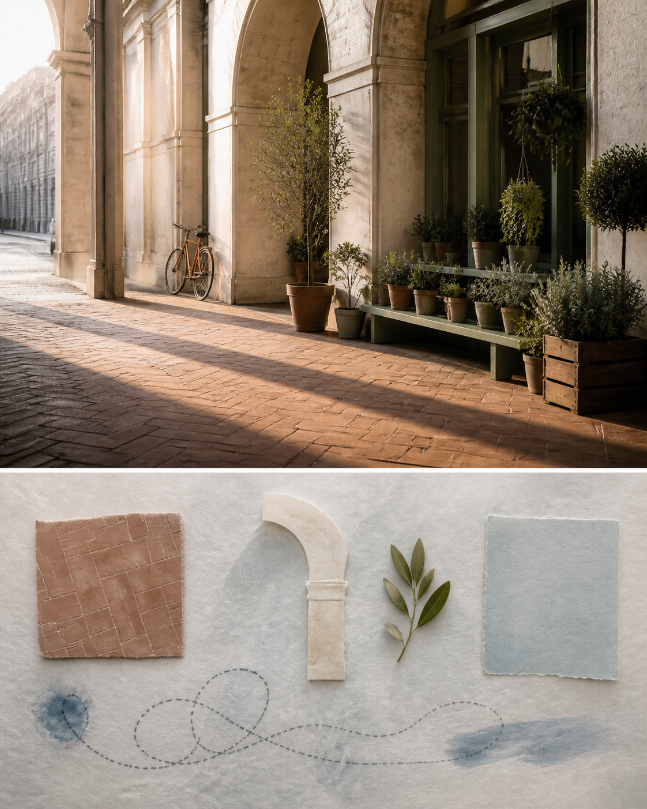
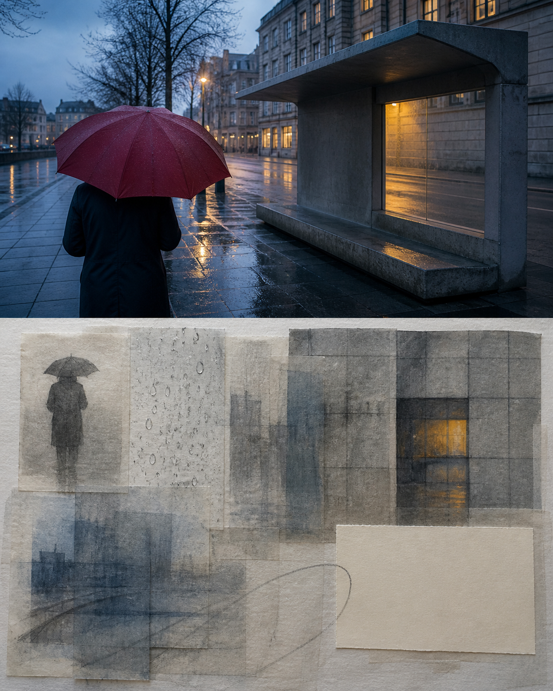

# Citywalk Map Poem

> **[Generate this style in PixPix →](https://www.pixpix.com/?source=github62)**

[中文](README.md)

An original `城市夜行` image-making Skill. It keeps the upper part of a photograph recognisable, then rebuilds the lower panel as an original simplified route trace, three place-texture studies and a blank caption tile. The goal is a citywalk post that centres feeling, not a real route.

## Three text-free examples

## Best for

street corner, pavement, architecture and a small stop. Its default tone is curious and observant, with stone, brick, faded blue and the tactile character of tracing paper, pencil, map line.

## Use

`Use $photo-to-citywalk-map-poem to process this photo at editorial density, focusing on one detail that matters to me.`

## Rights

Original instructions by Jack-chen-cyber. Upload only images you are entitled to use. The Skill must not reproduce brands, artists, copyrighted imagery, tickets, pages, routes, or source text; the lower panel is an original interpretation, not a factual archive.

- License: [CC BY-NC 4.0](LICENSE.md)
- PixPix workflow: [PixPix](https://www.pixpix.com/?source=github62)
## Install in Codex

1. Clone or download this repository: `git clone https://github.com/Jack-chen-cyber/awesome-memory-image-skills.git`.
2. Copy the complete `skills/photo-to-citywalk-map-poem` directory into Codex's Skills directory; on Windows, the default is `%USERPROFILE%\.codex\skills\photo-to-citywalk-map-poem`.
3. Restart or reload Codex, then invoke `$photo-to-citywalk-map-poem` in a conversation.

Do not copy only `SKILL.md`; keep `agents/`, `LICENSE.md`, and the page files with the Skill.

## Generate in PixPix

> **[Generate this style in PixPix →](https://www.pixpix.com/?source=github62)**
>
> Upload a photo you have the right to use, choose an upper/lower composition, and give PixPix this Skill name plus the detail you want to emphasise. PixPix is an independent generation workflow and does not host this Skill.
