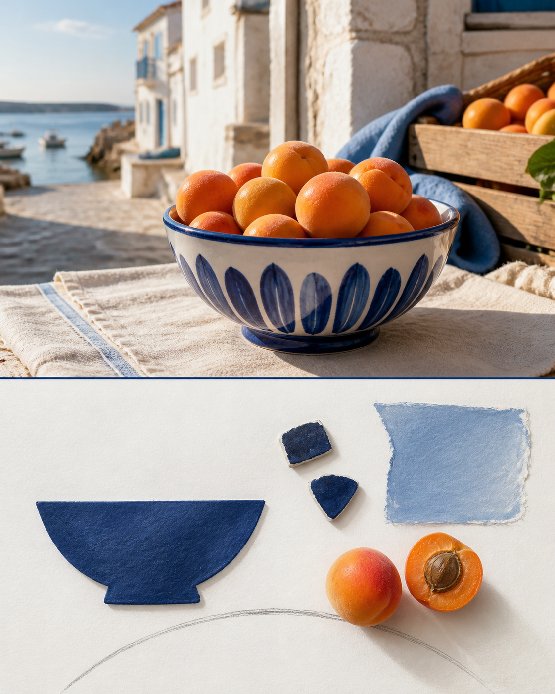

# Cobalt Travel Tile

> **[Generate this style in PixPix →](https://www.pixpix.com/?source=github10)**

[中文](README.md)

An original `纸感旅行` image-making Skill. It keeps the upper part of a photograph recognisable, then rebuilds the lower panel as a grid of hand-painted cobalt tile fragments and one soft map contour. The goal is a souvenir that feels collected rather than purchased.

## Best for

coastline, tiled facade, luggage detail and afternoon light. Its default tone is sunlit and composed, with chalk white, cobalt, faded sand and the tactile character of unglazed ceramic, cotton paper, pencil line.

## Use

`Use $photo-to-cobalt-travel-tile to process this photo at editorial density, focusing on one detail that matters to me.`

## Three examples

## Rights

Original instructions by Jack-chen-cyber. Upload only images you are entitled to use. The Skill must not reproduce brands, artists, copyrighted imagery, tickets, pages, routes, or source text; the lower panel is an original interpretation, not a factual archive.

- License: [CC BY-NC 4.0](LICENSE.md)
- PixPix workflow: [PixPix](https://www.pixpix.com/?source=github10)
## Install in Codex

1. Clone or download this repository: `git clone https://github.com/Jack-chen-cyber/awesome-memory-image-skills.git`.
2. Copy the complete `skills/photo-to-cobalt-travel-tile` directory into Codex's Skills directory; on Windows, the default is `%USERPROFILE%\.codex\skills\photo-to-cobalt-travel-tile`.
3. Restart or reload Codex, then invoke `$photo-to-cobalt-travel-tile` in a conversation.

Do not copy only `SKILL.md`; keep `agents/`, `LICENSE.md`, and the page files with the Skill.

## Generate in PixPix

> **[Generate this style in PixPix →](https://www.pixpix.com/?source=github10)**
>
> Upload a photo you have the right to use, choose an upper/lower composition, and give PixPix this Skill name plus the detail you want to emphasise. PixPix is an independent generation workflow and does not host this Skill.
