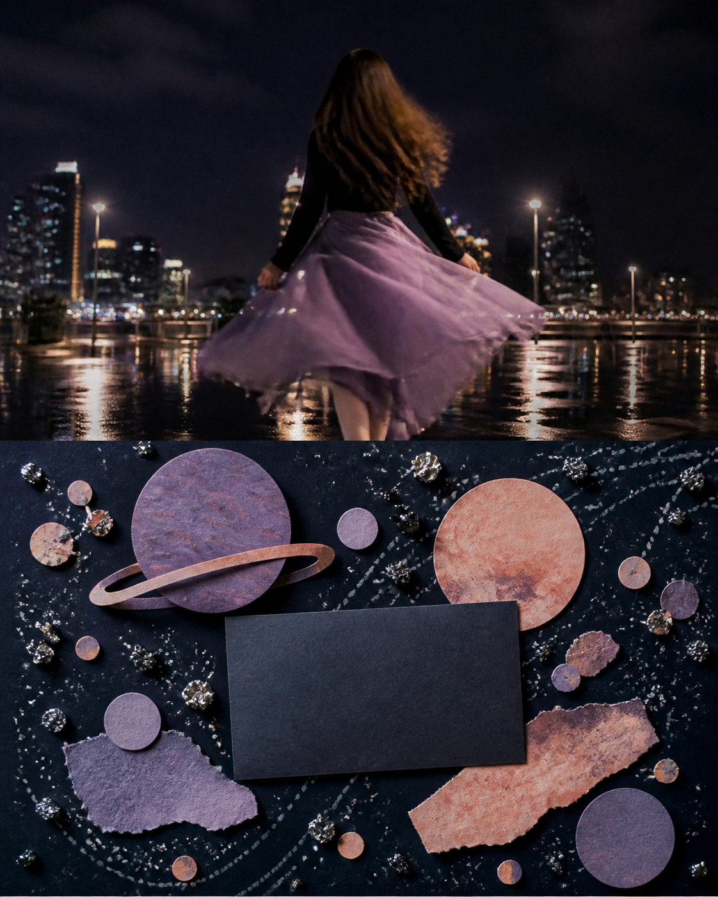
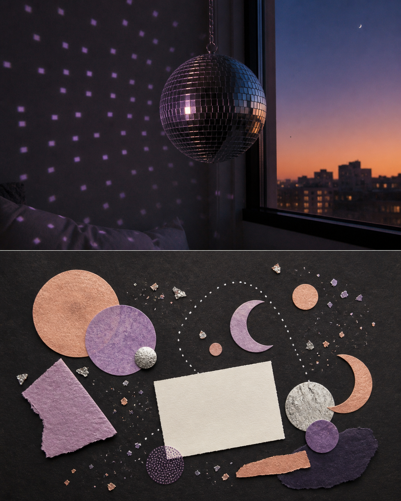
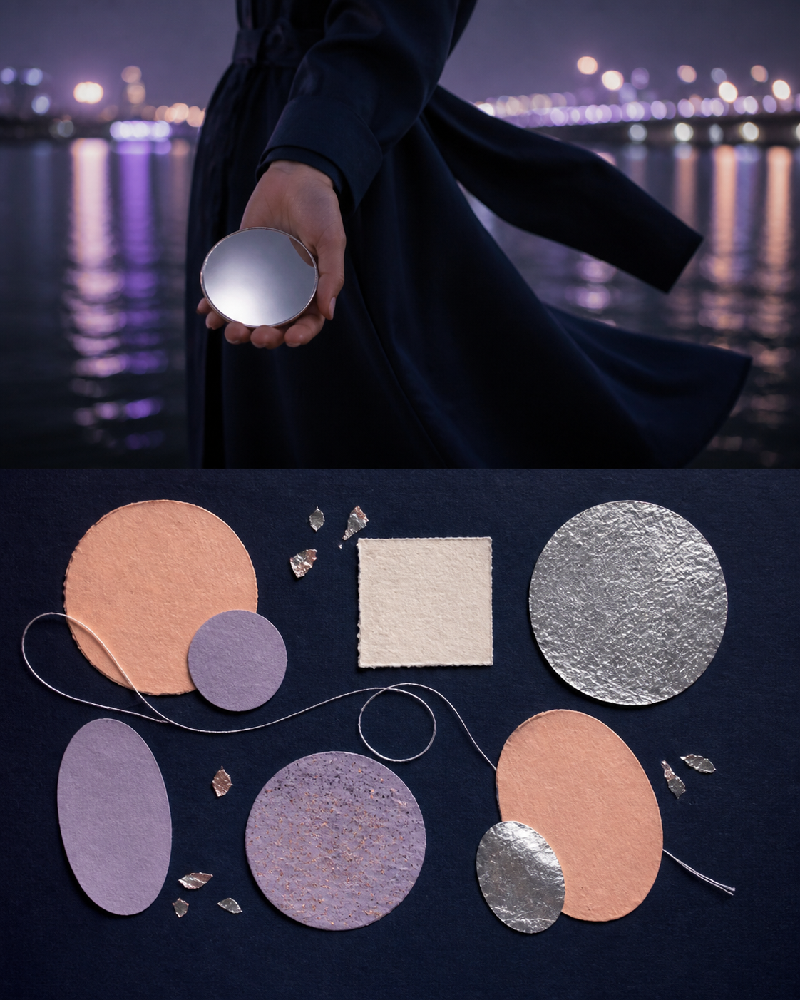

# Cosmic Diary Collage / 宇宙日记拼贴

> **[在 PixPix 生成这个风格 →](https://www.pixpix.com/?source=github63)**

[English](README_EN.md)

这是「玩趣收藏」系列的原创图片创作 Skill。上传一张照片后，上半保留可辨识的真实瞬间；下半以 **paper planets, a star chart-like abstraction and a blank diary card** 重新创作，重点是 celestial imagination without astrology claims。

## 三张无文字示例

## 适合的照片

night colour, reflective material, movement and mood。默认气质为「dreamy and playful」，使用 midnight, lilac, silver, peach 的克制配色，并保留 foil fleck, dark paper, soft pastel 的触感。

## 使用方式

`用 $photo-to-cosmic-diary-collage 处理这张照片，选择 editorial 密度，并把重点放在我最在意的一个细节上。`

## 权利与边界

本 Skill 为 Jack-chen-cyber 的原创指令。请只上传拥有使用权的照片；不要要求它复刻品牌、艺术家、版权图像、票据、书页、路线或原图文字。下半部分是原创视觉解释，不是事实档案。

- Author / 作者：Jack-chen-cyber
- Status / 状态：Original / 原创
- License / 许可：[CC BY-NC 4.0](LICENSE.md)
- PixPix workflow / PixPix 工作流：[PixPix](https://www.pixpix.com/?source=github63)
## 安装到 Codex

1. 克隆或下载本仓库：`git clone https://github.com/Jack-chen-cyber/awesome-memory-image-skills.git`。
2. 将完整目录 `skills/photo-to-cosmic-diary-collage` 复制到 Codex 的 Skills 目录；Windows 默认可用 `%USERPROFILE%\.codex\skills\photo-to-cosmic-diary-collage`。
3. 重启或重新加载 Codex，然后在对话中调用 `$photo-to-cosmic-diary-collage`。

不要只复制 `SKILL.md`：请保留同目录中的 `agents/`、`LICENSE.md` 和页面文件。

## 在 PixPix 生成

> **[在 PixPix 生成这个风格 →](https://www.pixpix.com/?source=github63)**
>
> 上传拥有使用权的照片，选择上下拼接构图，并把本页的 Skill 名称与想强调的细节一起告诉 PixPix。PixPix 是独立生成工作流，不托管本 Skill。
