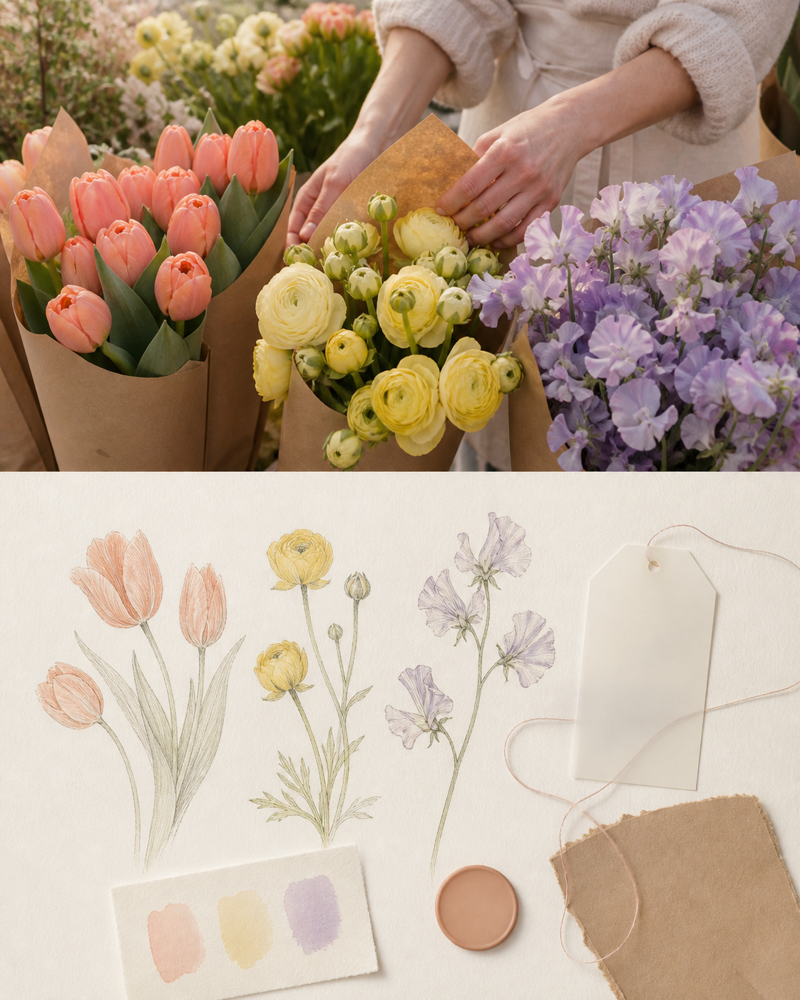
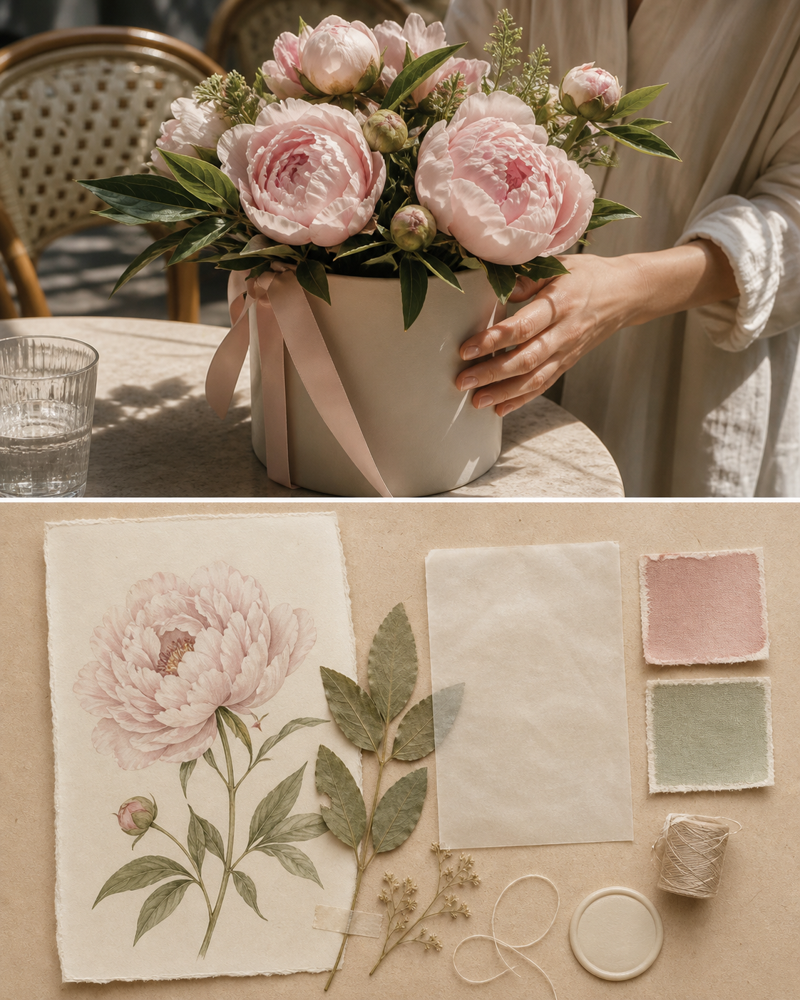
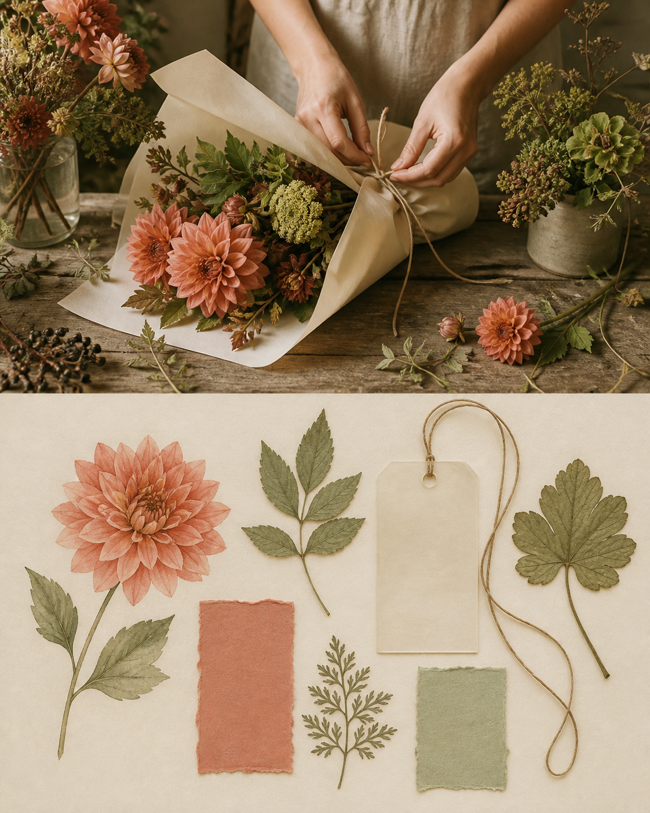

# Photo-to-Flower Market Ephemera

> **[Generate this style in PixPix →](https://www.pixpix.com/?source=github65)**

Turn a photo into a 4:5 florist’s archive: the real scene remains above; below, botanical studies, vellum, colour swatches, and fibre paper become an original ephemera composition.

## Use

`Use $photo-to-flower-market-ephemera to turn this flower-market photo into a soft early-spring cotton-paper keepsake.`

## Three text-free examples

## Rights

Original Skill by Jack-chen-cyber, licensed under [CC BY-NC 4.0](LICENSE.md). Use only images you are entitled to use; the output must not copy florist branding, proprietary packaging, botanical plates, or source text.

[Try the independent PixPix workflow](https://www.pixpix.com/?source=github65)
## Install in Codex

1. Clone or download this repository: `git clone https://github.com/Jack-chen-cyber/awesome-memory-image-skills.git`.
2. Copy the complete `skills/photo-to-flower-market-ephemera` directory into Codex's Skills directory; on Windows, the default is `%USERPROFILE%\.codex\skills\photo-to-flower-market-ephemera`.
3. Restart or reload Codex, then invoke `$photo-to-flower-market-ephemera` in a conversation.

Do not copy only `SKILL.md`; keep `agents/`, `LICENSE.md`, and the page files with the Skill.

## Generate in PixPix

> **[Generate this style in PixPix →](https://www.pixpix.com/?source=github65)**
>
> Upload a photo you have the right to use, choose an upper/lower composition, and give PixPix this Skill name plus the detail you want to emphasise. PixPix is an independent generation workflow and does not host this Skill.
